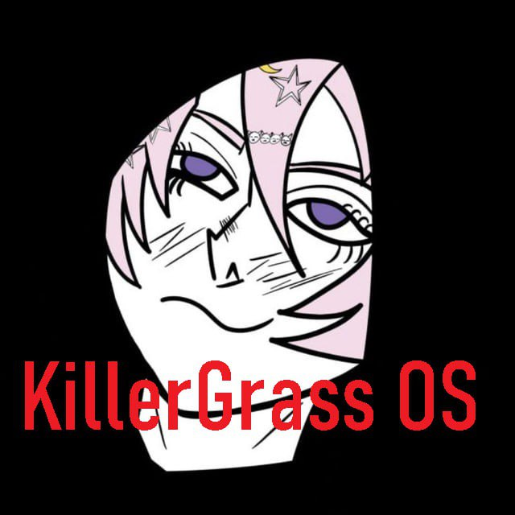

# KillerGrass OS (KGOS)

> **KillerGrass OS (KGOS)** is a simple 32-bit operating system with a modular kernel, GRUB/Multiboot support, VGA driver, basic command shell, and demo user code. See below for Russian description and details.

---


[]()

<div align="center">

</div>

**KillerGrass OS (KGOS)** — простая 32-битная операционная система с модульным ядром, VGA-драйвером, базовой командной оболочкой и демонстрационным пользовательским кодом.

**!Внимание!**

Ранее проект назывался FecalOS - в коде оно встречается. Сочтите за пасхалку)

Последняя версия: v0.0002

[Биография проекта](BIO-FECALOS.md)

---

## Быстрый старт

### Сборка и запуск в QEMU

```bash
sudo apt install gcc nasm binutils grub-pc-bin xorriso qemu-system-x86
make clean && make
qemu-system-x86_64 -drive format=raw,file=os.img -serial stdio -no-reboot -no-shutdown
```

---

## 📁 Структура проекта

```
KGOS/
├── drivers/           # Драйверы устройств (VGA, клавиатура)
│   ├── vga.c/h
│   ├── keyboard.c/h
├── kernel.c           # Ядро: инициализация, проверки, запуск fecalos_main
├── fecalos.c          # Пользовательская/демонстрационная логика ОС
├── fecalos.h          # Прототип fecalos_main
├── string.c/h         # Строковые функции
├── types.h            # Собственные типы (size_t, uint32_t и др.)
├── boot.asm           # Загрузчик
├── multiboot_header.asm # Multiboot2 заголовок
├── linker.ld          # Скрипт линковки
└── Makefile           # Система сборки
```

## Сборка

### Требования

- gcc (32-битная поддержка)
- nasm
- ld, objcopy (binutils)
- grub-mkrescue, xorriso (для ISO)
- qemu-system-x86 (для теста)

### Основные команды

```bash
make clean         # Очистить сборку
make               # Собрать образ os.img (флоппи)
make run           # Запустить os.img в QEMU
```

---

## Запуск

- **Флоппи-образ:**
  ```bash
  make run
  ```

---

## Архитектура

- **kernel.c** — инициализация драйверов, проверки, запуск fecalos_main
- **fecalos.c** — пользовательская логика, приветствие, демонстрация возможностей
- **drivers/** — VGA, клавиатура (PS/2)
- **commands/** — help, info, clear, echo, version
- **shell.c/h** — простая командная строка
- **types.h** — собственные типы для freestanding-сборки

---

## Возможности

- VGA текстовый режим (16 цветов, индивидуальный фон для каждой строки)
- PS/2 клавиатура (обработка ввода)
- Командная строка (CLI)
- Базовые команды (help, info, clear, echo, version)
- Модульная архитектура (ядро ≠ пользовательская логика)
- Сборка ISO и запуск в QEMU

---

## Contributing

Pull requests, issues, and suggestions are welcome! Feel free to fork the project and make it better. See the code comments for style and humor guidelines :)

---

## License

[](LICENSE)

---

### Created by KillerGrass

<div align="center">


[](https://github.com/UbicaTravy)
[](https://t.me/killergrass_programms)
[](https://t.me/kanal_kashkamalhika)
</div>

<div align="center">

## Contacts

[](https://t.me/KillerGrassContactBot)
[](mailto:killergrasscontact@gmail.com)
</div>
